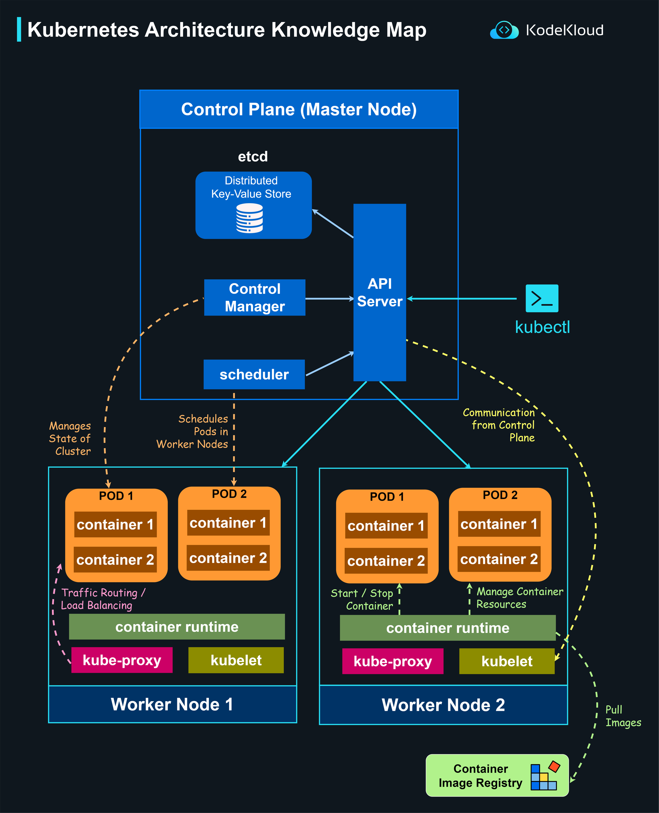

# Comprehensive Kubernetes Architecture & Networking Guide

## 1. Kubernetes High-Level Architecture

Kubernetes adheres to a decoupled, master-worker topology split into two functional layers: the **Control Plane** (the cluster's analytical brain) and the **Worker Nodes** (the cluster's execution system). This split ensures fault tolerance, horizontal scaling, and separation of concerns.



## 2. Control Plane & Worker Node Components

### The Control Plane (The Brain)
The Control Plane makes global decisions, monitors cluster health, and drives the cluster toward the desired state defined in YAML manifests.

* **`kube-apiserver`:** The synchronous core and front end of the Control Plane. It exposes the Kubernetes API and acts as the gatekeeper for all structural mutations. Every component — internal or external (`kubectl`) — communicates exclusively through the API Server. It handles authentication, authorization, and admission control.
* **`etcd`:** A distributed, consistent, highly available key-value store. It serves as the cluster's absolute source of truth, storing all configuration data, state declarations, and runtime metadata. If data is not written to `etcd`, it does not exist in the cluster.
* **`kube-scheduler`:** The logistical matchmaker. It scans the API Server for newly instantiated Pods that lack an assigned node. It evaluates the Pod's resource constraints (CPU/Memory requirements, taints) against the available capacity of worker nodes, computes a placement score, and binds the Pod to the optimal worker node.
* **`kube-controller-manager`:** A single binary housing a suite of distinct, continuous background loops (controllers). Each controller runs a non-stop reconciliation cycle: **Observe Current State, Compare Against Desired, State Execute Corrections.**
    * *ReplicaSet Controller:* Spawns or terminates Pods to match specified counts.
    * *Node Controller:* Monitors infrastructure health and flags unresponsive nodes.
    * *EndpointSlice Controller:* Dynamically links network Services to matching target Pods.

### The Worker Nodes (The Muscle)
Worker Nodes are the machines dedicated to executing containerized processes.

* **`kubelet`:** An agent running directly on the node's host OS. It acts as the local node captain. It registers the node with the API Server and consumes assigned PodSpecs. It interacts with the local Container Runtime to start, stop, and monitor containers, and handles self-healing via health probes.
* **`kube-proxy`:** A network agent running on every node that implements the Kubernetes Service abstraction. It acts as a configuration manager for the host node's kernel network stack, writing the dynamic routing rules that map static virtual IPs to live container endpoints.
* **Container Runtime:** The engine responsible for low-level container isolation and lifecycle management (e.g., `containerd` or `CRI-O`). It pulls container images from registries and sets up namespaces and cgroups under instructions from the Kubelet.

## 3. Workload Abstractions: Pods, Deployments, and StatefulSets

### Pods
The **Pod** is the atomic building block of the Kubernetes object model. It represents a single runnable instance of an application. 
* **Composition:** A Pod can contain one or more tightly coupled containers that share the exact same network namespace (including IP address and ports), storage volumes, and loopback interface (`localhost`).
* **Lifecycle:** Pods are strictly **ephemeral and disposable**. They are assigned an IP address at startup, but if they crash or the underlying node fails, they are destroyed and replaced with a new instance containing a completely different IP.

### Deployments vs. StatefulSets
To manage the ephemeral nature of Pods, Kubernetes uses higher-level workloads. The choice between a `Deployment` and a `StatefulSet` depends entirely on whether the application is stateless or stateful.

| Operational Vector | Deployments | StatefulSets |
| :--- | :--- | :--- |
| **Target Workload** | **Stateless Apps** (e.g., API Gateways, Web Frontends, Microservices). | **Stateful Apps** (e.g., PostgreSQL, Kafka, RabbitMQ, Redis). |
| **Pod Naming Conventions** | Ephemeral, random hash suffixes (e.g., `api-app-7b56f-x9y2`). | Stable, deterministic, zero-indexed ordinals (e.g., `db-0`, `db-1`, `db-2`). |
| **Storage Association** | Shared or ephemeral storage. Replaced Pods do not preserve volume relationships. | **Sticky Storage**. Each ordinal Pod maps to its specific PersistentVolume via a VolumeClaimTemplate. If `db-1` dies, its replacement binds to the exact same disk. |
| **Scaling Mechanics** | Non-ordered, concurrent creation and deletion. | Strict, ordered, sequential deployment  |
| **Network Identity** | Pods are anonymous and interchangeable. | Each Pod features a unique, predictable network DNS subdomain linked to a Headless Service. |

---

## 4. Kubernetes Networking & DNS Architecture

Kubernetes operates under a fundamental network requirement: **Every Pod receives a unique, routable IP address within the cluster, and every Pod can communicate directly with any other Pod without utilizing Network Address Translation (NAT).**

### CoreDNS: In-Cluster Service Discovery
Inside every cluster runs **CoreDNS**, a flexible, extensible DNS server registered as a service. It watches the Kubernetes API for new Services and EndpointSlices, generating real-time DNS records.
* **Standard Resolution Format:** When a Service named `inventory-service` is deployed in the namespace `default`, CoreDNS creates a Fully Qualified Domain Name (FQDN) mapping to its virtual IP:
    *Example:* `inventory-service.default.svc.cluster.local`

---

## 5. Services: ClusterIP vs. Headless Services

Because Pods are ephemeral, applications cannot rely on direct Pod IPs for communication. Kubernetes **Services** provide a stable, long-lived entrypoint.

### Standard ClusterIP Services (Stateless Load Balancing)
A standard `ClusterIP` Service provides a single, permanent virtual IP address and port combination. 

```
[ Client Pod ] ──> [ Service ClusterIP: 10.96.0.5 ] ──(iptables Random DNAT)──> [ Pod-1 OR Pod-2 ]
```

1.  **Creation:** The Control Plane allocates a static virtual IP from the cluster's internal network pool (e.g., `10.96.0.5`).
2.  **Kube-Proxy Programming:** `kube-proxy` on every node intercepts this event and configures the host kernel network stack using iptables proxy modes:
    * **`iptables` Mode:** `kube-proxy` writes a sequence of randomized rules inside the Linux netfilter framework. When a client Pod sends a packet to `10.96.0.5`, the kernel intercepts it, uses a statistical module to pick a destination Pod, and performs **Destination Network Address Translation (DNAT)** to overwrite the target IP with the real Pod IP.
3.  **CoreDNS Behavior:** CoreDNS maps `inventory-service.default.svc.cluster.local` to the single virtual IP `10.96.0.5`.

### Headless Services (Stateful Topology Discovery)
For stateful clusters like databases or message brokers, centralized virtual IP routing is counterproductive; the system must target specific nodes (e.g., writing to a primary vs. reading from a replica). This is solved by setting `clusterIP: None` in the YAML declaration.

```
[ Client Pod ] ──> Queries CoreDNS ──> Returns Direct List: [10.244.1.12, 10.244.2.45] ──> Direct TCP Connection
```

1.  **Bypassing Kube-Proxy:** Because no `ClusterIP` is generated, `kube-proxy` ignores the resource entirely. No `iptables` rules are written to the host kernel.
2.  **DNS Direct Mapping:** When a client application queries CoreDNS for a Headless Service, the DNS server bypasses the virtual IP tier and directly returns the array of **A records** containing the real, underlying IP addresses of all healthy matching Pods.
3.  **Individual Pod Addressing:** When paired with a `StatefulSet`, CoreDNS generates explicit DNS entries for individual pod ordinals
    *Example:* `db-0.db-service.default.svc.cluster.local` explicitly resolves to the IP of the first database node.

### How Client Applications Select Pods in Headless Architecture
With standard load balancing removed, the client application must determine which endpoint to connect to. This typically follows three distinct operational patterns:

1.  **The "Smart Client" Pattern (Databases/Message Brokers):** Modern application drivers (e.g., MongoDB, Kafka, or PostgreSQL SDKs) are cluster-aware. The driver connects to any IP returned by the Headless Service to bootstrap the connection. It then executes an internal topology command (e.g., `isMaster()`), learning the explicit role of every node in the cluster. The SDK then intelligently handles routing internally—sending write operations to the primary node and read operations to replication endpoints.
2.  **Deterministic Topology Configuration:** Engineers can hardcode or configure specific application sub-components to bind directly to targeted ordinals using their deterministic DNS addresses (e.g., anchoring an analytical data-ingestion sync to `db-2.db-service` while applications run standard read/writes against `db-0.db-service`).
