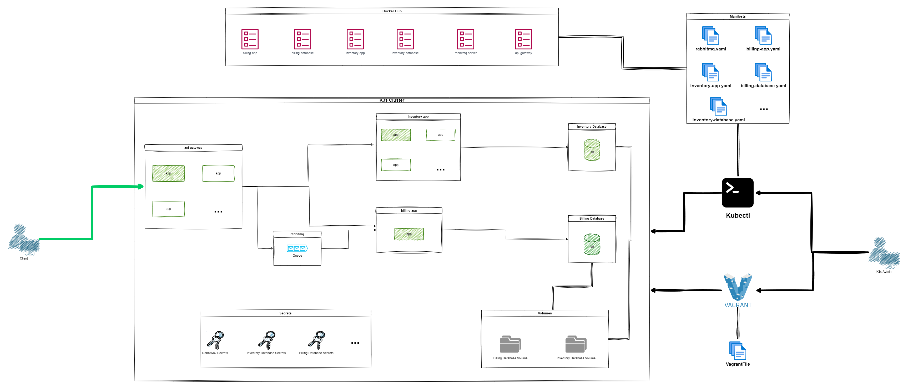

## Orchestrator

### Overview

This project introduces Kubernetes by deploying a complete microservices architecture in a K3s cluster. You will practice container orchestration, scaling, and resource management and secure handling of credentials. By completing this project, you will understand how to deploy, manage, and maintain resilient microservices using Kubernetes.

### Learning Objectives

By completing this project, you will be able to:

- Deploy microservices and databases in a K3s cluster using Kubernetes manifests.
- Configure horizontal scaling and StatefulSets for resilient and efficient workloads.
- Manage secrets and credentials securely in Kubernetes.
- Integrate container images from Docker Hub and orchestrate their deployment.
- Document and justify your cluster architecture and deployment choices.

### Architecture Instructions



You have to deploy this microservices architecture in a K3s cluster
consisting of the following components:

- The `inventory-db` container is a PostgreSQL database server that contains
  the inventory database. It must be accessible via port `5432`.
- The `billing-db` container is a PostgreSQL database server that contains
  the billing database. It must be accessible via port `5432`.
- The `inventory-app` container is a server that contains the
  inventory-app code running and connected to the inventory database and
  accessible via port `8080`.
- The `billing-app` container is a server that contains the billing-app
  code running and connected to the billing database and consuming messages
  from the RabbitMQ queue, and it can be accessed via port `8080`.
- The `rabbit-queue` container is a RabbitMQ server that contains the queue.
- The `api-gateway-app` container is a server that contains the
  API gateway code running and forwarding the requests to the other
  services, and it is accessible via port `3000`.

### The cluster

By using K3s in Vagrant you must create two virtual machines:

1. `Master`: the master in the K3s cluster.

2. `Agent`: an agent in the K3s cluster.

You must install `kubectl` on your machine to manage your cluster.

The nodes must be connected and available!

```console
$> kubectl get nodes -A NAME
STATUS   ROLES    AGE    VERSION
<master-node>   Ready    <none>   XdXh   vX
<agent1-node>   Ready    <none>   XdXh   vX
$>
```

You must provide a `orchestrator.sh` script that run and create and manage the
infrastructure:

```console
$> ./orchestrator.sh create
cluster created
$> ./orchestrator.sh start
cluster started
$> ./orchestrator.sh stop cluster stopped $>
```

### Docker Hub

You will need to push the Docker images for each component to Docker Hub.

> You will use it in your Kubernetes manifests.

### Manifests

You should create a YAML Manifest that describes each component or resource of
your deployment - one manifest per component.

### Secrets

You must store your passwords and credentials as a K8s secrets.

> It's forbidden to put your passwords and credentials in the YAML manifests,
> except the secret manifests!

### Applications deployment instructions

The following applications must be deployed as a deployment, and they
must be scaled horizontally automatically, depending on CPU consumption.

- `api-gateway-app`: max replication: 3 min replication: 1 CPU percent trigger: 60%

- `inventory-app`: max replication: 3 min replication: 1 CPU percent trigger:
  60%

The `billing-app` must be deployed as _StatefulSet_.

### Databases

Your databases must be deployed as _StatefulSet_ in your K3s cluster, and you
must create volumes that enable containers to move across infrastructure
without losing the data.

### Documentation

You must push a `README.md` file containing full documentation of your solution
(prerequisites, configuration, setup, usage, ...).

### Bonus

If you complete the mandatory part successfully, and you still have free time,
you can implement anything that you feel deserves to be a bonus, for example:

- Use the `Dockerfile` you have defined in your solution for
  `play-with-containers`

- Deploy a Kubernetes Dashboard to monitor the cluster

- Deploy a dashboard for applications logs

- Kubernetes in cloud ?!

Challenge yourself!

### Submission and audit

You must submit the `README.md` file and all files used to create and delete
and manage your infrastructure: Vagrantfile, Dockerfiles, Manifests, ...

```console
.
├── Manifests
│   └── [...]
├── Scripts
│   └── [...]
├── Dockerfiles
│   └── [...]
└── Vagrantfile
```

If you decide to use a different structure for your project remember you should
be able to explain and justify your decision during the audit.

> In the audit you will be asked different questions about the concepts and the
> practice of this project, prepare yourself!

#### What's next?

In order to develop your knowledge and career as a DevOps engineer, we highly
recommend you to learn and practice more about Kubernetes and even get a
certification for Kubernetes.

[https://kubernetes.io/training/](https://kubernetes.io/training/)